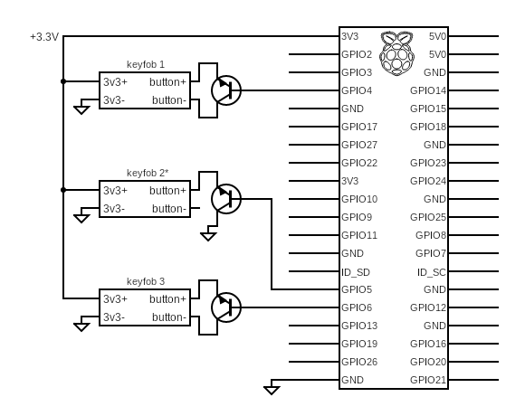

## WORK IN PROGRESS

# keyfob-manager
raspberry pi to control keyfobs (car, house alarm, etc)

## Intro
> This is a semi-destructive project - meaning that you will need to 'sacrifice' your keyfob(s) because you will be soldering in leads. This is not a big deal with some cheap keyfobs, such as the [Honeywell 5834-4](https://www.amazon.com/dp/B00SZ304ZK/?coliid=IP6QMZRKBK948) but can be quite a bit more expensive for things like car keyfobs.

The reason this project started is because I have had multiple incidences in which someone has tried to break into my car. I wanted a way to trigger a car lock signal every night at X time. Due to modern security measures, you can't just 'send a signal' to the car. The remotes would be very difficult to mimic, so I believe the easiest approach is to just solder in a transistor that is connected to a raspberry pi.

Once the transistor is wired across the button on the keyfob, it will mimic a button press just as if you had actually physically pressed the button on the fob.

> unless you want to occationally test and replace batteries, you will most likely want to remove the battery and wire the power side to the 3v3 supply from the rpi. Double check that your keyfob uses 3v3 power, but so far every keyfob I've come across has used 3v3.

From here, you can simply program the pi in whatever way you want. You can have it press the button at a certain time, or certain conditions or use ifttt webhooks... really, whatever you can imagine.

This is a work in progress. If all you want to do is trigger a lock at a certain time of day (for example, you want to send a lock signal every night at 8pm), this is very straight forward as long as you don't mind doing a little bit of soldering. The wiring is the same no matter how you want to trigger the lock (cron, ifttt, etc). I suppose if you don't want to bother with ifttt and listening for webhooks, you could use an arduino board and probably be even easier/cheaper.

> note: While the fundamental problem is pretty simple (wire a transistor across the button) we want to *also* replace the battery in the keyfob so we don't have to worry about a power source. (So far) All the keyfobs have used a 3v battery so using the 3.3v output from the raspberry pi has worked well. Using the pi as a 3v power supply *and* using the pi to power the transistor adds complexity (obviously).

## schematic



## requirements
```
sudo apt update && sudo apt upgrade -y
sudo apt install python3-pip python3-flask
pip3 install flask
```

## flask
> to listen for get requests (for remote triggering, i.e. ifttt)
``` python
from flask import Flask, request, abort

import RPi.GPIO as g
from time import sleep

things = {'house': 4,
          'bmw': 6,
          'lexus' : 5}

g.setmode(g.BCM)
g.setwarnings(False)
g.setup(things['bmw'],g.OUT)
g.setup(things['lexus'],g.OUT)
g.setup(things['house'],g.OUT)

def activate(pin):
        print("output high, LED on, pressing button")
        g.output(pin,g.HIGH)
        sleep(2)
        print("output low, LED off, released button")
        g.output(pin,g.LOW)
        sleep(1)

app = Flask(__name__)


@app.route('/webhook', methods=['GET'])
def webhook():

    thing = request.args['thing']

    thing = thing.strip().lower()

    try:
        activate(things[thing])
    except ValueError:
        print("that thing doesn't exist")

    return  ''' The thing is: {} '''.format(thing)
    #abort(400)


if __name__ == '__main__':
     app.run(host='0.0.0.0', port=80, debug=True)
```

## crontab
> running this as a cronjob is the easiest way to to do this. If you ONLY want to run this as a cronjob, you don't need to worry about flask, ifttt, port forwarding, etc.

The below example will run at 3:30am each day. Keep in mind that it is based off the system clock, so if the system clock is set to UTC, this may be actually 6:30pm local (or whatever the timezone difference is for you).

`$cat ~/keyfob/arm.py`
```python
import RPi.GPIO as g
from time import sleep

house = 4
bmw = 6
lexus = 5

g.setmode(g.BCM)
g.setwarnings(False)
g.setup(bmw,g.OUT)
g.setup(lexus,g.OUT)
g.setup(house,g.OUT)


def activate(pin):
	print("output high, LED on, pressing button")
	g.output(pin,g.HIGH)
	sleep(2)
	print("output low, LED off, released button")
	g.output(pin,g.LOW)
	sleep(1)

activate(bmw)
activate(lexus)
activate(house)
```

`$ crontab -e`
`30 3 * * * python /home/pi/keyfob/arm.py`


## firewall & port forwarding
Set up your router to forward the port you need to the flask server. This will vary greatly depending on what router you have but the general settings should look something like this:

Item      |Setting
:---------|:----------
From IP   |Any
From Port |The port you entered into ifttt
To IP     |IP address of Raspberry Pi
To Port   |Flask port


## ifttt
> to trigger via iftt (for alexa and/or google home integration - for example, or any other triggers)

 This (Google Assistant    | That (Webhook)
:-------------------------:|:-------------------------:
 | 
